# Part 1. Ready-made docker
- As the final goal of your little practice you have immediately chosen to write a docker image for your own web server, so first you need to deal with a ready-made docker image for the server. You chose a pretty simple nginx.

## == Task ==

## Take the official docker image from nginx and download it using docker pull.
## Check that the image is running with docker ps

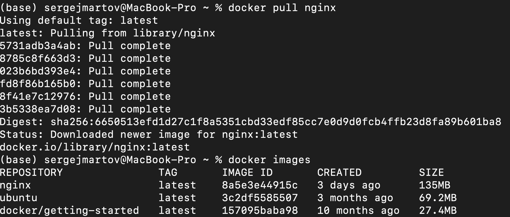

## Run docker image with docker run -d [image_id|repository]
- docker run -p 80:80 -p 443:443 8a5e3e44915c

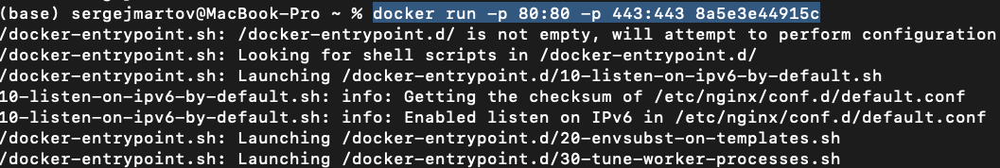

## Check that the image is running with docker ps

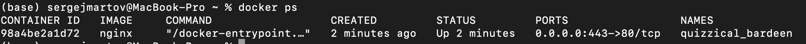

## View container information with docker inspect [container_id|container_name]

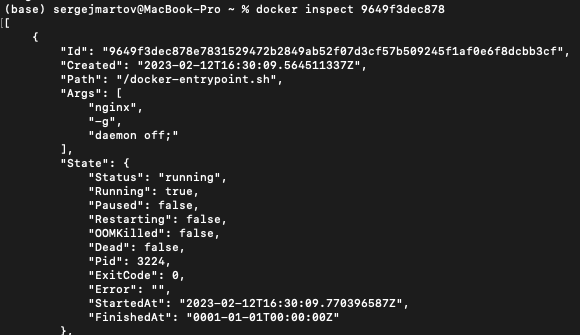

- From the command output define and write in the report the container size, list of mapped ports and container ip
- container size:  1.09kB (virtual 135MB)
- "IPAddress": "172.17.0.3",
- "ExposedPorts": {"443/tcp": {}, "80/tcp": {}

## Stop docker image with docker stop [container_id|container_name]

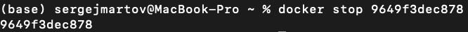

## Check that the image has stopped with docker ps

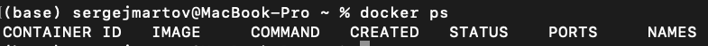

## Restart docker container with docker restart [container_id|container_name]
## Check in any way that the container is running

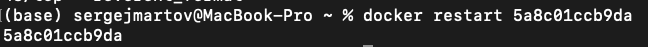

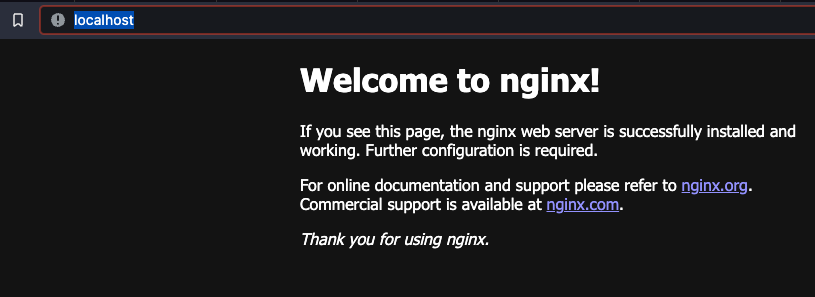

# Part 2. Operations with container

- Docker image and container are ready. Now we can look into nginx configuration and display page status.

## == Task ==

## Read the nginx.conf configuration file inside the docker container with the exec command

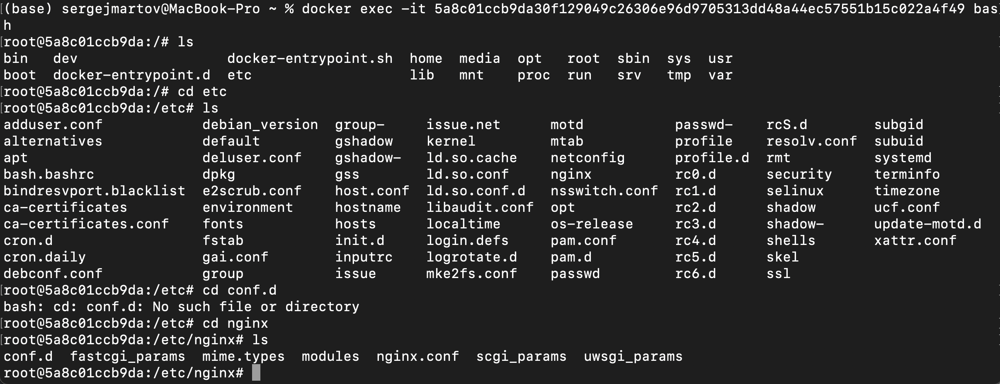

- Подключаемся внутрь работающего контейнера с помощью команды docker exec -it 5a8c01ccb9da30f129049c26306e96d9705313dd48a44ec57551b15c022a4f49 bash
- Нужный файл лежит по адресу etc/nginx/ngnix.conf

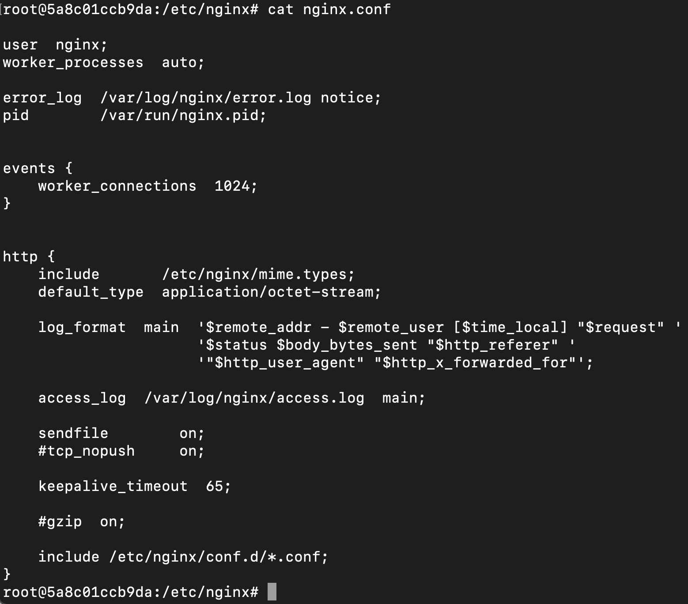

- Вот что там внутри

## Create a nginx.conf file on a local machine

- Создаем конфиг 
- user  nginx;
worker_processes  auto;
error_log  /var/log/nginx/error.log notice;
pid        /var/run/nginx.pid;
events {
    worker_connections  1024;
}
http {
    server {
        location = /status {
            stub_status on;
        }
    }
}
## Copy the created nginx.conf file inside the docker image using the docker cp command

- Заливаем его внутрь контейнера
- docker cp /Users/sergejmartov/Desktop/nginx.conf reverent_fermat:/etc/nginx/

## Restart nginx inside the docker image with exec

- Перегружаем контейнер
- docker container exec reverent_fermat nginx -s reload

## Check that localhost:80/status returns the nginx server status page

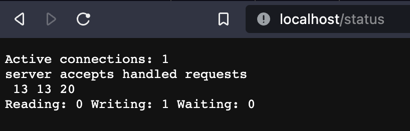

## Export the container to a container.tar file with the export command
- Экспортируем docker export --output="container.tar" reverent_fermat

## Stop the container

- docker container stop reverent_fermat

## Delete the image with docker rmi [image_id|repository]without removing the container first

docker rmi -f 8a5e3e44915c

## Delete stopped container

- docker rm reverent_fermat
 
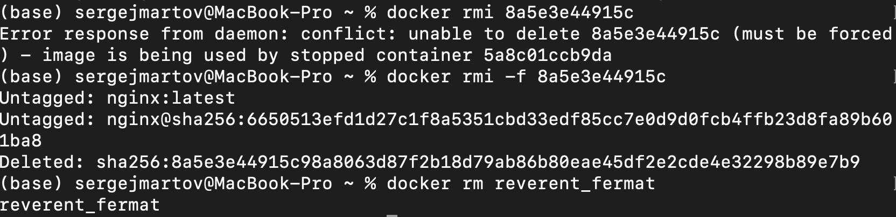

## Import the container back using the importcommand

- docker import container.tar 

## Run the imported container
## Check that localhost:80/status returns the nginx server status page
- docker run -d -p 80:80 -p 443:443 fd959ecd52f9 /docker-entrypoint.sh nginx -g "daemon off;"
- Службы надо перезапустить в новом контейнере!

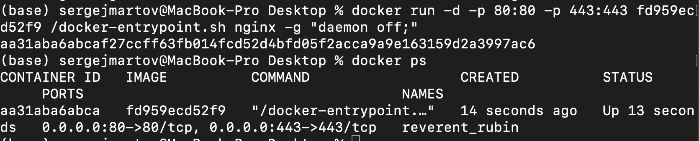
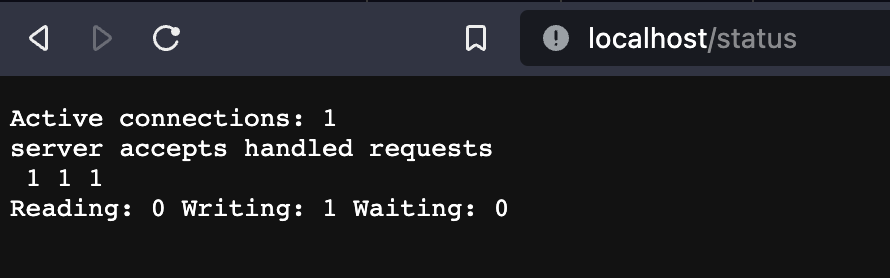
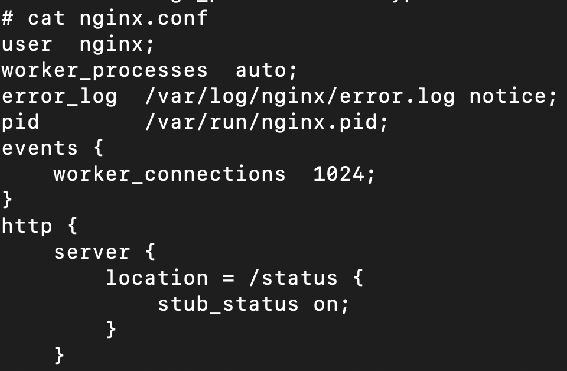

# Part 3. Mini web server

## == Task ==

## Write a mini server in C and FastCgi that will return a simple page saying Hello World!
- сервер будет выглядеть вот так
- #include "fcgi_stdio.h"
- #include <stdlib.h>

- int main(void)
- {
    - while(FCGI_Accept() >= 0)
   - {
       - printf("Content-type: text/html\r\nStatus: 200 OK\r\n\r\nHello World!");
    - }

    - return 0;
- }
- Внутрь контейнера надо поставить все необходимые зависимости, чтобы FastCgi работал.
- Логинимся в контейнер docker run -it fd959ecd52f9 bin/bash и устанавливаем все необходимое для работы:
- apt-get install gcc
- apt-get install spawn-fcgi
- apt-get install libfcgi-dev
- копируем файл с проектом в контейнер docker cp /Users/sergejmartov/Documents/21/Devops/D05/hello.c reverent_rubin:/home 
-  компилим и запускаем gcc -o hello hello.c -lfcgi и spawn-fcgi -p 8080 ./hello
  
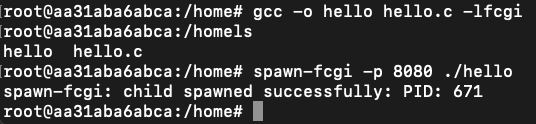

- останавливаем контейнер docker stop
- создаем на базе контейнера новый образ docker commit reverent_rubin neocon
- перезапускаем его с маппингом 81 порта.

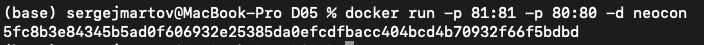

- опять запускаем внутри свой файл Hello World
- spawn-fcgi -p 8080 ./hello
-  Теперь по localhost:81 есть Hello World

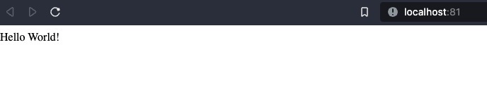

